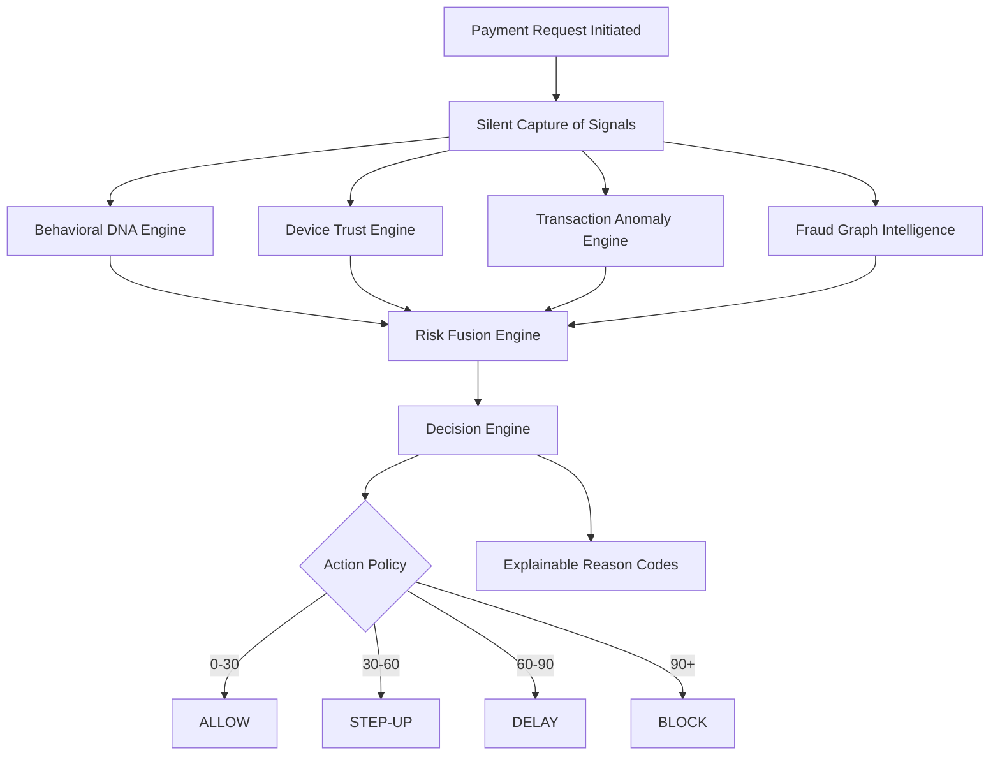

# PayShield: Pre-Transaction Real-Time Fraud Prevention Middleware

## One-Line Pitch
**PayShield is a pre-transaction fraud prevention platform that fuses behavioral biometrics, device trust, ML anomaly detection, and graph intelligence to stop fraud before money moves.**

---

## 💡 PayShield: Full Hackathon Idea

PayShield is a **real-time, pre-transaction fraud prevention system**. The core idea is not to detect fraud after money is gone, but to score risk **before approval** using four signals: **behavior**, **device trust**, **transaction anomaly**, and **graph relationships**. It serves as a multi-layer fraud intelligence system with a final **risk score from 0 to 100** and a decision output of **Allow, Step-Up, Delay, or Block**.

---

## ⚠️ The Problem It Solves

Digital payment fraud is increasing because attackers use phishing, credential theft, and device spoofing. Traditional OTP/password checks are too weak, static rules do not adapt, behavioral misuse is missed, and fraud rings stay hidden when systems do not analyze relationships between accounts and devices. PayShield responds directly to these gaps.

---

## 🧠 Core Product Concept

PayShield acts like a **fraud brain** sitting between the payment request and final approval.

It evaluates four indicators in parallel:
1. **Behavioral DNA**: Understands the user's normal interaction speed and patterns.
2. **Device Trust**: Checks whether the device is known, healthy, and trusted.
3. **Transaction Anomaly**: Flags unusual transaction patterns using Machine Learning.
4. **Fraud Graph Intelligence**: Detects hidden fraud networks and mule clusters.

Then, it fuses all signals into one actionable score and returns an explainable decision.

---

## 🌐 Where PayShield Sits in the Payment Lifecycle

PayShield does **not** replace GPay, UPI, card rails, or banking apps. It sits **between the payment request and the final authorization decision** as a fraud-risk middleware layer.

### Real-Life UPI / GPay Flow Example:
1. User enters UPI PIN or clicks **Pay** in a wallet app.
2. The wallet app sends the payment request to the UPI/bank layer.
3. Before the transaction is finalized, the bank backend sends the request to **PayShield**.
4. PayShield evaluates the four signals in parallel, generating a risk score between **0 and 100**.
5. The decision engine maps the score to an action:
   * **0–30** → **Allow** (transaction is approved and completed).
   * **30–60** → **Step-Up** (requires multi-factor challenge / OTP).
   * **60–90** → **Delay** (placed in a temporary hold queue for review).
   * **90+** → **Block** (payment is stopped immediately).
6. The payment continues only if approved. Otherwise, it is challenged or stopped before the money leaves the source account.

---

## 🏗️ System Architecture

The middleware consists of six core modules:
* **Behavioral DNA Engine** (Dwell, flight, speed biometrics)
* **Device Trust Engine** (OS, browser, IP subnet, geo-location)
* **Transaction Anomaly Engine** (Isolation Forest ML model)
* **Fraud Graph Intelligence** (NetworkX relationship analyzer)
* **Risk Fusion Engine** (Aggregated weighted scoring)
* **Decision Engine** (Threshold policy and reason codes)



---

## ⚙️ Module-by-Module Technical Explanation

### 1) Behavioral DNA Engine
* **Purpose**: Capture user interaction patterns, build a baseline profile for each user, and compare live activity against that baseline to flag account takeover (ATO) or bot-assisted automated scripts.
* **Mechanism**: Measures keystroke **dwell time** (time key is held down), **flight time** (time between keys), **mouse speed**, **mouse jitter** (standard deviation), and **scroll velocity**.
* **Adaptive Learning**: Safely updates the user's profile slowly over time (`alpha = 0.05`) for safe transactions to accommodate natural user behavior drift.
* **Bot Identification**: Detects automated script inputs that have absolute zero mouse jitter or perfectly uniform typing flight times.

### 2) Device Trust Engine
* **Purpose**: Collects device fingerprints and network parameters to identify new devices or session hijacking.
* **Signals**: OS, browser, IP address subnet, device hash, and geo-location.
* **Logic**: Evaluates whether the device is registered to the user. Same-device logins with massive geo-location shifts or IP mismatches (e.g. traveling VPN) raise base risk. New devices from unfamiliar locations trigger high risk. Blacklisted devices immediately return a device score of `100.0`.

### 3) Transaction Anomaly Engine
* **Purpose**: Evaluates transaction parameters to detect statistical outliers.
* **Algorithm**: **Isolation Forest** (from `Scikit-learn`), contamination = 0.05.
* **Features**: Amount, transaction hour, 1-hour velocity, 24-hour velocity, and geo-distance from the user's last transaction.
* **Cold Start Strategy**: Dynamically trains on actual historical transactions if they exist; otherwise, seeds a realistic synthetic baseline distribution on startup to allow immediate, zero-latency inference.

### 4) Fraud Graph Intelligence
* **Purpose**: Maps relationships between accounts, IPs, and device fingerprints to find hidden rings, mule-account networks, and compromised clusters.
* **Structure**: Undirected `Graph` modeled with `NetworkX`.
  * **Nodes**: Users, Devices, Target Accounts.
  * **Edges**: `USER_DEVICE`, `USER_TRANSACTION`.
* **Graph Pathfinding**: Uses shortest-path distance analysis to known flagged nodes:
  * **Distance = 1**: Active user or device itself is flagged as fraudulent (`100` risk).
  * **Distance = 2**: Shared device or bank account with a known fraudster/mule (`80` risk).
  * **Distance = 3**: Neighbor within the compromised cluster circle (`40` risk).
  * **Distance >= 4**: Safe relationship distance (`0` risk).

### 5) Risk Fusion Engine
* **Purpose**: Combines all four independent risk signals into one aggregated total score to avoid relying on a single weak signal.
* **Weighting Formula**:
  $$\text{Total Risk} = (0.25 \times \text{Behavioral}) + (0.25 \times \text{Device}) + (0.30 \times \text{Anomaly}) + (0.20 \times \text{Graph})$$
* **Aggregated Output**: Normalizes the final score to a standard **0–100** range.

### 6) Decision Engine
* **Purpose**: Enforces policy boundaries to recommend a concrete action and generate transparent reason codes.
* **Thresholds**:
  * **0–30**: **ALLOW** (Low Risk)
  * **30–60**: **STEP-UP** (Medium Risk: requires challenge, OTP, or biometrics)
  * **60–90**: **DELAY** (High Risk: placed on manual/temporary hold for analysis)
  * **90+**: **BLOCK** (Critical Risk: transaction cancelled instantly)
* **Explainability Codes**: Generates transparent reason tags (e.g., `BOT_PATTERN_DETECTED`, `HIGH_AMOUNT`, `NEW_DEVICE`, `FRAUD_RING_LINK`) so judges and analysts can immediately inspect the system's decision reasoning.

---

## 🛠️ Hackathon Technical Stack & Deployment

### Scalable Stack Layering
* **Frontend**: React + Vite (or Next.js) styled with Tailwind CSS and Lucide Icons. Visualizations powered by Recharts (for risk radars/breakdowns) and custom SVG canvases (for dynamic Graph relationship maps).
* **Backend**: FastAPI with async Python, SQLModel/SQLAlchemy, and Pydantic for validation schemas.
* **ML Layer**: Scikit-learn (Isolation Forest) for rapid real-time multi-dimensional inference.
* **Graph Layer**: NetworkX for prototype-grade relationship pathfinding.
* **Storage**: SQLite for zero-config relational storage; can scale to Supabase (Postgres) and Redis cache in production.

### Integration Patterns
* **Pattern A: Bank-Side Integration**: PayShield sits as a webhook inside the bank's core ledger auth loop.
* **Pattern B: Payment Gateway Integration (Chosen for MVP)**: A simulated payment processor calls PayShield's `/transaction/score` endpoint to get an authorization decision before finalizing payment.
* **Pattern C: App-Side Advisory Layer**: Visual warning banner presented during checkout.

---

## 🗄️ Database Design (Suggested Entities)

* `users`: Holds identity information and absolute fraud status (`is_fraudster`).
* `devices`: Device fingerprints linked to users, with trust state (`is_trusted`).
* `behavior_profiles`: Saved baselines of keystroke and mouse biometrics per user.
* `transactions`: Core payment logs, recording status (`ALLOWED`, `BLOCKED`, `PENDING`).
* `risk_scores`: Relational breakdowns of sub-scores (Behavioral, Device, Anomaly, Graph).
* `decision_logs`: Records final decision, thresholds applied, and explainable reason codes.
* `alerts`: Actively flagged incidents above risk thresholds for analyst action.
* `graph_edges`: Explicit connections representing transaction and device relationships.

---

## 📋 Suggested API Contract

### 1. `POST /api/transaction/score`
* **Request**:
```json
{
  "user_id": "user_alice",
  "amount": 2500.00,
  "target_account": "acc_mule_account",
  "device": {
    "device_hash": "device_unknown_macbook",
    "browser": "Chrome",
    "os": "macOS",
    "ip_address": "192.168.1.99",
    "location": "London, UK"
  },
  "behavior": {
    "keystroke_dwell": 0.082,
    "keystroke_flight": 0.091,
    "mouse_speed": 420.5,
    "mouse_jitter": 0.0,
    "scroll_velocity": 12.0
  }
}
```

* **Response**:
```json
{
  "transaction_id": "tx_8f3d1b9c2a5e4",
  "username": "Alice",
  "user_id": "user_alice",
  "amount": 2500.0,
  "target_account": "acc_mule_account",
  "risk_score": 82.5,
  "decision": "DELAY",
  "reason_codes": [
    "HIGH_AMOUNT",
    "BOT_PATTERN_DETECTED"
  ],
  "breakdown": {
    "behavioral_score": 95.0,
    "device_score": 50.0,
    "anomaly_score": 86.4,
    "graph_score": 40.0
  }
}
```

### 2. `GET /api/alerts/live`
* SSE connection streaming scored transactions to the dashboard.

### 3. `GET /api/graph/data`
* Exposes nodes and links representation of the relationship graph.

---

## 🚀 Interactive Demo Scenarios

### Scenario 1: Safe Payment
* **Inputs**: Known device, normal transaction amount, familiar behavioral baseline.
* **Expected Action**: **ALLOW** (Risk score < 30).

### Scenario 2: Suspicious Login / Device Shift
* **Inputs**: New iPhone device, different IP location (California), slight behavioral drift.
* **Expected Action**: **STEP-UP** (Risk score 30–60, triggers OTP verification).

### Scenario 3: Anomaly / Night Transfer (Bot)
* **Inputs**: Extreme amount, 3 AM time, Tor Browser, perfectly uniform typing, zero mouse jitter.
* **Expected Action**: **BLOCK** or **DELAY** (Risk score > 90, `BOT_PATTERN_DETECTED`).

### Scenario 4: Fraud Ring Traversal
* **Inputs**: Bob logs in from a device hash previously linked to Mallory (flagged fraudster).
* **Expected Action**: **BLOCK** (Risk score 80–100, `FRAUD_RING_LINK`).

---

## 📈 Scalability and Performance Focus
In production environments, pre-transaction authorization cannot afford to introduce multi-second latency. PayShield is designed to keep latency under **50ms** by:
1. **Redis Caching**: Reading hot session profiles and trusted device histories from Redis instead of hitting disk.
2. **Lightweight ML**: Pre-training the Isolation Forest offline or in asynchronous background threads, keeping synchronous inference overhead to sub-millisecond rates.
3. **Optimized Queries**: Fetching sub-graphs or local NetworkX relationships only for active nodes.
